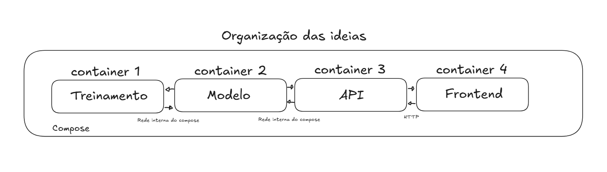
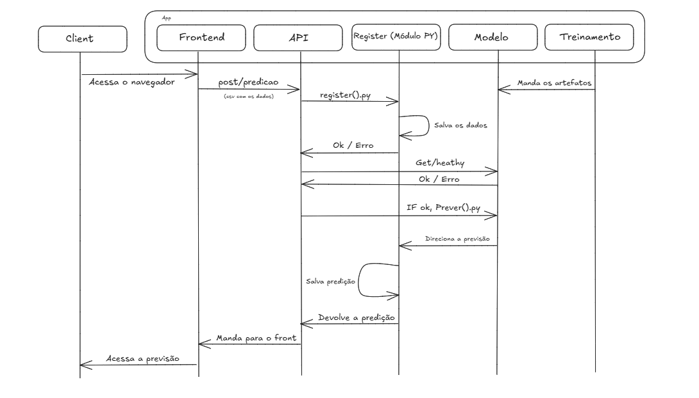

# Ponderada Rafael Cabral da Silva

## Dev Log 

### Idealização do problema: 
#### Desafio:
Construa e documente uma solução conteinerizada que treine um modelo para estimar o valor futuro de uma moeda, como o Bitcoin, a partir de dados históricos. O treinamento deve ser executado em um container Docker ou em um notebook. Ao final, o modelo treinado deve ser disponibilizado em um segundo container, que executará um backend para carregá-lo e oferecer predições à aplicação.

#### Como desenhei a solução de forma macro: 



Usei o https://excalidraw.com/ para organizar as ideias. Basicamente pensei em usar um compose para subir diferentes containers dentro de um mesmo App. 

Pensei em dividir em *Treinamento*, onde consigo gerar os artefatos das predições através do Host. Através da rede interna gerada no compose, o treinamento irá alimentar o container do *modelo*, assim consigo deixar a aplicação modular e variar os tipos de modelos preditivos no futuro. Pensando em produção, ter uma *API* containerizada faz sentido para que fique a parte das alterações nos modelos e seja fácil de debugar e por fim o *Frontend* no qual o client vai se comunicar via HTTP. (LocalHost)

### Como o sistema deve funcionar:



A minha lógica é: O client acessa o navegador, interage com o frontend, inputa os dados, fazemos um post na API, ela salva isso no register, se tudo for salvo corretamente, a API retorna OK. Depois disso verificamos se o modelo está funcionando com o Get/health e se positivo os dados inputados vão para o container do modelo (via rede interna do compose) fazer a previsão. Esse modelo foi alimentado com os artefatos do treinamento e vai retornar a previsão, que passa novamente pelo register e encaminha para a API mandar no frontend. Os dados serão inputados e armazenados em um arquivo CSV (Dado o tempo curto da ponderada). Vale destacar que o register é um módulo python que fica dentro da API. Iremos salvar os treinamentos em um arquivo .pkl no qual o service modelo vai acessar para fazer as predições. 

### Construção do Modelo 

#### Treinar e exportar o modelo 
Aqui usei o auxilio do Claude Code para construir o bruto do código. (Evidenciando já de cara). 

O objetivo aqui era: treinar um modelo dentro de um container Docker e salvar o resultado num arquivo (.pkl) que o container Modelo vai carregar depois, igual ao que mencionei na documentação a cima.

##### Explicação dos arquivos
- docker-compose.yml - Define o serviço treinamento e liga as pastas artifacts/ e data/ do Host às do container, desse jeito o arquivo .pkl vai aparecer também no host

- treinamento/Dockerfile - Monta a imagem.

- Treinamento/requirements.tx - Lista as bibliotecas. 

- treinamento/train.py: Aqui é onde o treinamento acontece de fato. 

#### Train.py: 
1 - Pega os dados: baixa 2 anos de preços diários do Bitcoin do Yahoo Finance e salva uma cópia em data/btc.csv. Isso é bom para rodar sem internet, pois esse csv vai ficar salvo localmente. 

2- Monta os exemplos: para cada dia, usa os 7 fechamentos anteriores para prever o fechamento do dia atual. 

3 - Fazemos o "split", separamos o treino e teste por tempo, usando 80% mais antigo para treinar o modelo e 20% dos mais atuais para testar o modelo. Por se tratar de uma série temporal, não podemos embaralhar os dados para o modelo não ter acesso aos dados do futuro. 

4 - Treina uma regressão linear Simples. 

5 - Avalia: calcula o erro médio (MAE) do modelo e o compara com um baseline ingênuo, "o preço de amanhã é igual ao de hoje" (Naive), métricas que vimos nas aulas de matemática do Diogo.

6 - Exportamos, 
- artifacts/model.pkl: o modelo mais as informações que o container Modelo vai usar (quantos lags espera, versão do sklearn, data do treino, últimos 7 preços).

- artifacts/metrics.json: as mesmas informações em formato legível, como evidência.

##### Como rodar
Todos os comandos deste devlog rodam no **terminal do VS Code (PowerShell)**, aberto com `Ctrl + '`, com o Docker Desktop aberto.
```powershell
cd ~/Desktop/docker_ponderada/ponderada_murilo
docker compose run --rm treinamento
```

##### Resultado observado
```
Image ponderada_murilo-treinamento Built
[dados] baixando BTC-USD (2y) do Yahoo Finance
[dados] salvo em data/btc.csv
[dados] 731 dias, de 2024-10-05 a 2026-10-05
[treino] MAE modelo: 1032.23 USD | MAE baseline: 985.43 USD
[treino] previsão para o próximo dia: 85539.22 USD
[artefato] salvo em artifacts/model.pkl
```

Arquivos gerados no host:
- `data/btc.csv` (731 dias de fechamento do BTC)
- `artifacts/model.pkl` (artefato do modelo)
- `artifacts/metrics.json` (metadados e métricas)

##### Análise
O MAE do modelo (~1032 USD) ficou um pouco acima do baseline naive (~985 USD), ou seja, a regressão linear não superou o "amanhã = hoje". Isso faz sentido para cripto por variar bastante. Como o objetivo da ponderada é demonstrar a integração dos containers e não uma previsão financeira , mantive o modelo simples. Trocar o modelo no futuro só exige gerar um novo `model.pkl`, sem mexer nos outros containers. Preferi seguir o arroz com feijão e entregar algo que realmente sabia. 


### Preparar a inferência (desenvolver o container do Modelo)

Os códigos eu gerei com o ClaudeCode!! 

Objetivo: um backend em Python que carrega o `model.pkl` gerado pelo treinamento, da uma rota de predição e tenha uma forma simples de verificar se o serviço está ativo (o `Get/health` do diagrama).

##### Escolhas
- **FastAPI + Uvicorn:** framework Python leve, valida o JSON de entrada 
- **Mesmas versões de numpy/sklearn/joblib do treinamento:** garante que o `.pkl` carrega sem erro.
- **Volume `./artifacts`** é assim que o modelo treinado chega ao container de inferência. 
- **`depends_on` com `service_completed_successfully`:** o compose só sobe o Modelo depois que o Treinamento termina com sucesso, então o `.pkl` sempre existe quando o Modelo inicia. Sem isso, ao rodar o compose todos os services startam ao mesmo tempo (Não significa que concluiram, por motivos como tamanhos diferentes de imagens...), mas quando existe uma dependência entre os containers isso pode quebrar a aplicação. 
- **Porta 8001 exposta no host** só para testes. Na integração, a API vai chamar o Modelo pela rede interna do compose (`http://modelo:8000`).

##### Arquivos
- `modelo/Dockerfile`: Padrão (Não acho que vale explicar o óbvio)
- `modelo/requirements.txt`: Padrão (Não acho que vale explicar o óbvio)
- `modelo/main.py`: carrega o artefato ao iniciar e expõe:
  - `GET /health`: retorna `status: ok` e os metadados do modelo ou retorna 503 se o modelo não estiver carregado.
  - `POST /prever`: recebeos dados e devolve a previsão do próximo fechamento. Retorna 422 se não vierem exatamente 7 valores.

##### Como rodar
No terminal do VS Code (PowerShell):
```powershell
docker compose up -d --build modelo   # roda o treinamento e depois sobe o modelo
```

##### Testes
Health check:
```powershell
curl.exe localhost:8001/health
```
```json
{"status":"ok","ticker":"BTC-USD","n_lags":7,"trained_at":"2026-10-05T18:27:55.853028+00:00","sklearn_version":"1.5.2","metrics":{"mae_model_usd":1032.23,"mae_baseline_usd":985.43,"train_rows":579,"test_rows":145},"last_closes":[83622.43,83553.85,84853.1,84497.21,84763.58,86480.3,85446.61]}
```


### API e Frontend (integração)

Por último montei a API e o frontend para fechar o fluxo do diagrama.

A API (api/main.py) também é em FastAPI. A rota POST /predicao segue a ordem que desenhei: primeiro o register salva os dados, depois a API chama o /health do modelo e só se estiver ok pede a predição. O register é um módulo Python dentro da API (api/register.py) que grava tudo em registros/registro.csv. Ele salva a entrada como "recebido" e depois atualiza com a predição, ou com o erro caso algo dê errado. Coloquei também um healthcheck no modelo dentro do compose, assim a API só sobe quando o modelo já está respondendo.

O frontend é só uma página HTML servida por um Nginx. O Nginx repassa as chamadas de /api para o container da API pela rede interna, então o navegador só conversa com o frontend.

Para subir tudo:

```powershell
docker compose up -d --build
```

Depois é só abrir http://localhost:8080. A página já vem com os últimos 7 fechamentos reais, é só clicar em Prever.

Testei três casos. Com os 7 fechamentos reais a previsão voltou 85539.22, o mesmo valor que o treinamento imprimiu, o que mostra que o artefato chegou certo até o fim. Mandando só 3 valores voltou erro 422. E parando o modelo com docker compose stop modelo, a API devolveu 503 (modelo indisponível).

Assim ficou o registro.csv depois dos testes:

```
id,timestamp,closes,prediction,status
f69e559d,2026-10-05T18:41:47+00:00,83622.43;83553.85;84853.1;84497.21;84763.58;86480.3;85446.61,85539.22,ok
d6942a01,2026-10-05T18:41:47+00:00,1.0;2.0;3.0,,erro_modelo
b55daeaa,2026-10-05T18:41:52+00:00,83622.43;83553.85;84853.1;84497.21;84763.58;86480.3;85446.61,,modelo_indisponivel
```

Mesmo quando a predição falha, a entrada fica salva com o motivo, porque o register salva antes de chamar o modelo, igual está no diagrama.

### Conclusão

No fim, a solução ficou com quatro containers rodando juntos pelo docker compose. O treinamento baixa os dados do Bitcoin, treina uma regressão linear e salva o model.pkl na pasta artifacts. O container do modelo lê esse arquivo e oferece as rotas de health e de previsão. A API recebe os dados do frontend, salva tudo no CSV pelo register, confere se o modelo está ativo e devolve a previsão para a página.

O modelo em si é simples e não ganhou do baseline, mas o foco da ponderada era mostrar a integração entre treinamento, artefato, container de inferência e aplicação, e isso funcionou certinho: o mesmo valor que saiu no treinamento chegou até o navegador. Para reproduzir, basta rodar docker compose up -d --build e abrir http://localhost:8080.
